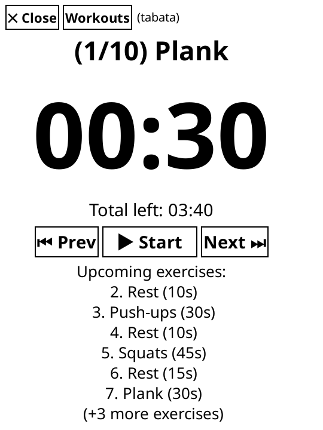
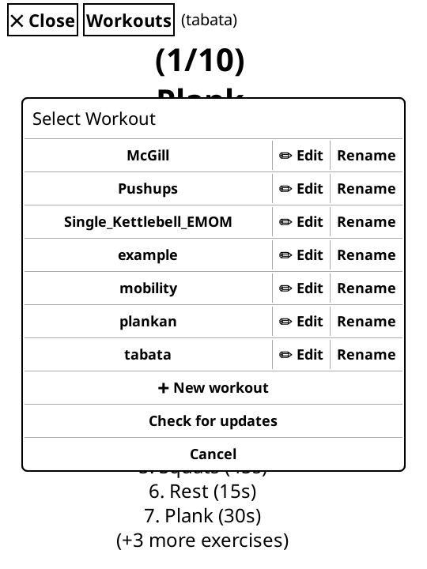

# KOReader Tabata Timer Plugin

A clean, customizable Tabata and interval training timer plugin for [KOReader](https://github.com/koreader/koreader) designed for e-ink devices.

<p align="center">
  <a href="screenshots/timer.png"></a>
  &nbsp;&nbsp;
  <a href="screenshots/workouts.png"></a>
</p>
<p align="center"><em>(Click on any screenshot to view full size)</em></p>

## Features

- **Large E-Ink Display:** Extra-large countdown clock and high-contrast text visible from a distance.
- **Total Workout Clock:** Shows total remaining workout time updated in real-time.
- **Manual & Step Controls:** Starts in paused state; control workout flow with `▶ Start` / `⏸ Pause`, `⏮ Previous`, and `Next ⏭` buttons.
- **Upcoming Exercises Preview:** Displays the next 6 scheduled exercises and count of remaining intervals.
- **Multiple Workout Routines, On-Device Editing & Renaming:** Switch workouts anytime from the **Workouts** menu, rename routines (updating `.csv` files automatically), and edit any workout's `.csv` file directly on your device using the built-in editor.
- **Over-The-Air (Wi-Fi) Updates:** Check for updates directly from GitHub over Wi-Fi with intelligent workout conflict resolution (keep local version, overwrite, or save as `.new.csv`).

---

## Installation Instructions

### Option 1: Install on an E-Reader Device (Kobo, Kindle, PocketBook, Android)

#### 1. Finding the KOReader folder on your Kobo (via USB)
1. Connect your Kobo device to your computer using a USB cable and tap **Connect** on the Kobo screen.
2. Open the newly mounted drive (usually named `KOBOeReader`):
   - **Important:** On Kobo devices, KOReader is installed inside the hidden **`.adds`** folder in the root directory:
     ```text
     <KOBOeReader drive>/.adds/koreader/plugins/
     ```
   - You must enable hidden files in your file manager to see `.adds`:
     - **Windows:** In File Explorer, click the **View** tab at the top $\rightarrow$ check **Hidden items** (or *Show $\rightarrow$ Hidden items* in Windows 11).
     - **macOS:** In Finder, open the `KOBOeReader` drive and press `Cmd` + `Shift` + `.` (period) to toggle hidden folders.
     - **Linux:** Press `Ctrl` + `H` in your file manager, or navigate in terminal with `cd /run/media/$USER/KOBOeReader/.adds/koreader/plugins/` (or `/media/$USER/KOBOeReader/.adds/koreader/plugins/`).
3. Navigate into the plugins directory:
   ```text
   .adds/koreader/plugins/
   ```

*(Note for other devices: Kindle and PocketBook usually use `koreader/plugins/` or `.koreader/plugins/`, and Android uses `/sdcard/koreader/plugins/`)*.

#### 2. Installing the plugin
4. Create a new folder named `tabatatimer.koplugin` inside `plugins/` if it does not already exist:
   ```text
   .adds/koreader/plugins/tabatatimer.koplugin/
   ```
5. Copy the following files and directories from this repository into `tabatatimer.koplugin/`:
   - `_meta.lua`
   - `main.lua`
   - `parser.lua`
   - `workouts/` (including `workouts/tabata.csv` and `workouts/example.csv`)
6. Safely eject/unmount your Kobo from the computer, disconnect the USB cable, and open/restart KOReader.

---

### Option 2: Install via Git Clone (Terminal / USB mount)

If you prefer using git from the terminal while your Kobo is connected via USB:

```bash
# Example for Linux/macOS when Kobo is mounted:
cd "/run/media/$USER/KOBOeReader/.adds/koreader/plugins"

# Clone directly as tabatatimer.koplugin:
git clone https://github.com/olundberg/koreader_tabata_timer.git tabatatimer.koplugin
```

---

### Option 3: Emulator & Development Setup (`kodev`)

If you are developing or testing with the KOReader emulator:

1. Clone this repository alongside the `koreader` repository (e.g. `../koreader_tabata_timer` and `../koreader`).
2. Run `make emulator` to create a symbolic link into the KOReader plugins directory:
   ```bash
   make emulator
   ```
   *Alternatively, create the symlink manually:*
   ```bash
   ln -s /absolute/path/to/koreader_tabata_timer /absolute/path/to/koreader/plugins/tabatatimer.koplugin
   ```
3. Start the emulator from your `koreader` directory:
   ```bash
   ./kodev run
   ```

---

## How to Use

1. In KOReader, open the top menu (available both in the File Manager and inside an open document).
2. Go to the **Tools** tab (the wrench/hammer icon).
3. Select **Tabata Timer** $\rightarrow$ **Start workout from CSV**.
4. **Controls:**
   - **`✕ Close`** (top left): Exit the timer.
   - **`Workouts`** (top bar): Open the workout selector:
     - Tap a **Workout name** to load that routine.
     - Tap **`✏ Edit`** next to any workout to edit its exercises and durations on-device in the text editor.
     - Tap **`➕ New workout`** to create a completely new routine CSV file directly on your device.
   - **`▶ Start` / `⏸ Pause` / `▶ Resume`:** Start, pause, or resume countdown.
   - **`⏮ Prev`:** Go back to the previous exercise.
   - **`Next ⏭`:** Skip to the next exercise.

---

## Configuring Your Workout Routines

Workouts are stored as `.csv` files inside the `workouts/` directory in `tabatatimer.koplugin/workouts/`.

You can add as many workout routines as you like (e.g. `cardio.csv`, `legs.csv`, `stretching.csv`).

Format: `<Exercise Name>,<Duration in Seconds>` per line.

Example `workouts/tabata.csv`:
```csv
Plank,30
Rest,10
Push-ups,30
Rest,10
Squats,45
Rest,15
```

Empty lines, full-line comments (starting with `#`), and inline comments (e.g., `Plank,30 # warmup`) are supported and ignored by the timer parser.

---

## Testing

To run parser unit tests:

```bash
make test
# or
lua tests/test_parser.lua
```

## License

This project is licensed under the [GNU Affero General Public License v3.0 (AGPL-3.0)](LICENSE) - see the [LICENSE](LICENSE) file for details.

